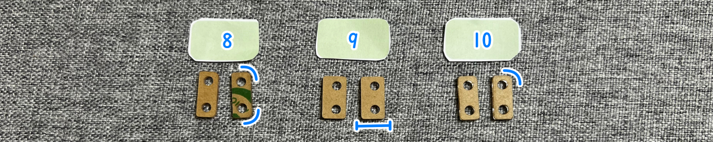
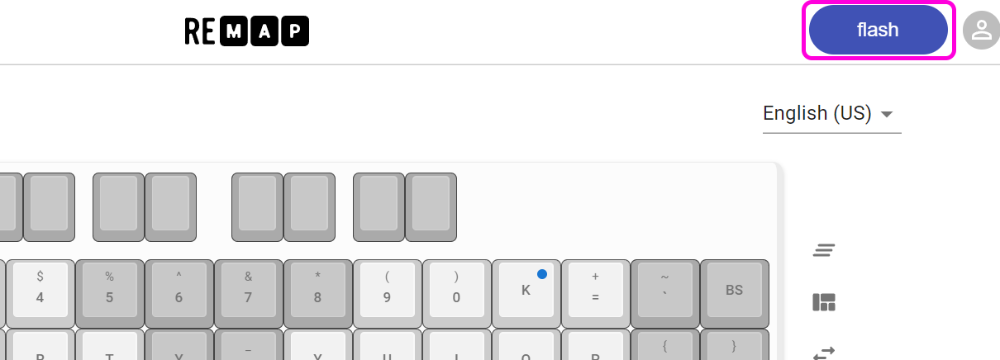
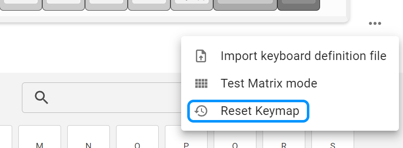
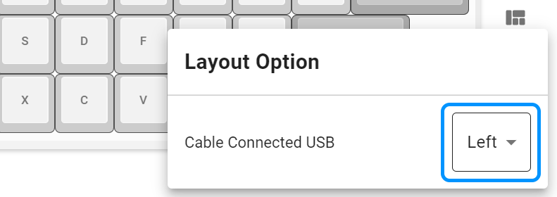
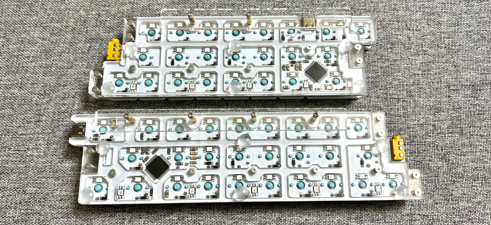

# Pop'n Top せまピッチ ビルドガイド（[English](https://github.com/Taro-Hayashi/Pop-n-top-NarrowPitch/blob/main/README_EN.md)）
- [キット内容](#キット内容)
- [キースイッチのはんだ付け](#キースイッチのはんだ付け)
- [プレートの取り付け](#プレートの取り付け)
- [キーマップのカスタマイズ](#キーマップのカスタマイズ)
- [そのほか](#そのほか)

## キット内容
 
||部品名|数| |
|-|-|-|-|
|1|メインボード|2||
|2|トッププレート|2||
|3|ミドルプレート大|2||
|4|ボトムプレート|2||
|5|位置決めプレート|2||
|6|なべネジ小|15|2.5mm|
|7|なべネジ中|12|4mm|
|8|ミドルプレート小8|4||
|9|ミドルプレート小9|4||
|10|ミドルプレート小10|4||
|11|平ネジ|27|3.5mm|
|13|スペーサー中|12|4mm|
|14|スペーサー大|6|6mm|
|15|スペーサー小|15|3mm|
|16|ゴム足|12||

### キット以外に必要なもの
|部品名|数|||
|-|-|-|-|
|[キースイッチ](https://shop.yushakobo.jp/products/pg1350)|50|Kailh choc V1|
|[キーキャップ](https://shop.yushakobo.jp/collections/keycaps/For-Choc-v1)|50|choc V1用、18x17mm以下|
|[TRRSケーブル](https://shop.yushakobo.jp/products/trrs_cable)|1||
|[Type-Cケーブル](https://shop.yushakobo.jp/products/usb_type_a_to_c_cable)|1||

### 必要な工具
|工具名|
|-|
|はんだごて|
|はんだ|
|精密ドライバー|

## キースイッチのはんだ付け
トッププレートをはさみこみ、キースイッチをはんだ付けします。  
  
はじめに4隅から取り付けると位置がズレにくいです。  
  
フラックスクリーナーを使う場合は綿棒などに滲みこませてフラックスの付いているところだけを拭いてください。
表面にフラックスクリーナーが浸透するとアクリルが割れてしまします。
  
TRRSケーブルで左右を繋ぎ、右手側にUSBケーブルを差してキーが入力されるか確認しましょう。
  

## プレートの取り付け
内側のネジ穴15か所（赤丸）にはナベネジ小とスペーサー小、外側のネジ穴12か所（青丸）にはナベネジ中とスペーサー中を取り付けます。
  
ミドルプレートをスペーサーに通します。
  
ミドルプレート小には種類が3つあるので確認しつつ使ってください。
  
バックプレートを平ネジ小でねじ止めしてゴム足を貼ります。
  
キーキャップを付けたら完成です。
  
LEDは初期状態では右手側左上のキーを押しながら右下のキーを押すとON/OFFできるようになっています。  

## キーマップのカスタマイズ
ChromeかEdgeでRemapにアクセスしてください。  
- Remap https://remap-keys.app/

  
左を選んで進んでいくとアドレスバーからメッセージが出てキーボードを選択できます。  

ドラッグアンドドロップでキーマップの変更が終わったら右上のflashボタンを押すと反映されます。  
  

## そのほか

### USBケーブルを左手側に接続する
Remapにファームウェアがあります。
- [Pop'n Top NarrowPitch - Remap ](https://remap-keys.app/catalog/1fWEWCmfpZw3S95DBEu1/firmware)

両手側とも左手側接続用のファームウェアに更新し、TRRSケーブルで左右を繋いで左手側にUSBケーブルを接続します。
- [ファームウェアを更新する方法](firmware.md)

Remapにアクセスしてキーボードを選択し、キーマップをリセットするかレイアウトを復元してください。
- [Remap](https://qmk018.remap-keys.app)

レイアウトオプションからLeftを選択します。

### 片側だけ使う
USB接続側のファームウェアを個別にインストールして使ってください。

### 液タブに乗せる
位置決めプレート、ネジ、スペーサーを使います。
  
傾斜が高い場合はゴム足を取り両面テープで貼り付けると安定します。

  

### ファームウェアのコード
https://github.com/Taro-Hayashi/qmk_firmware/tree/tarohayashi/keyboards/tarohayashi/popntop_np

### アクリルプレートのデータ
- [popntop_np.zip](https://github.com/Taro-Hayashi/Pop-n-top-NarrowPitch/releases/latest/download/popntop_np.zip)

### 販売ページ
- BOOTH https://tarohayashi.booth.pm/items/3754822
- 遊舎工房 https://shop.yushakobo.jp/products/4095
