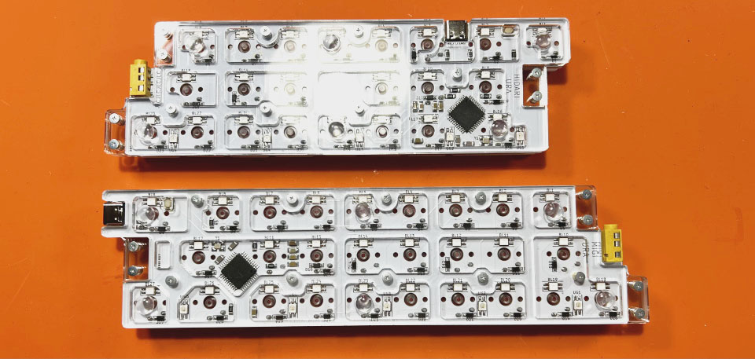

# Pop'n Top せまピッチ Build Manual（[日本語](https://github.com/Taro-Hayashi/Pop-n-top-NarrowPitch/blob/main/README.md)）
- [Contents](#Contents)
- [Soldering](#Soldering)
- [Assembling](#Assembling)
- [Customise](#Customise)
- [Misc](#Misc)

## Contents
  
  
||Name|Quantities| |
|-|-|-|-|
|1|Mainboards|2||
|2|Small pan head screws|15|2.5mm|
|3|Middle pan head screws|12|4mm|
|4|Flat head screws|27|3.5mm|
|5|Small spacers|15|3mm|
|6|Middle Spacers|12|4mm|
|7|Rubber feet|12||
|8|Middle plates #8|4||
|9|Middle plates #9|4||
|10|Middle plates #10|4||
|11|Top plates|2||
|12|Middle plates|2||
|13|Bottom plates|2||

### Additional required
|Name|Quantities|||
|-|-|-|-|
|Switches|50|Kailh choc V1|[Yushakobo](https://shop.yushakobo.jp/en/products/pg1350)|
|Keycaps|50|for choc V1|[Yushakobo](https://shop.yushakobo.jp/en/collections/keycaps/For-Choc-v1)|
|TRRS Cable|1|||
|Type-C Cable|1|||

## Soldering
Clip the top plate and solder the key switch.  
  
  
Do not soak the flux cleaner to avoid breaking the acrylic.  
  
Testing. Plug the USB cable into the right hand side.
  

## Assembling
Red circle for small pan head screws and small spacers. Blue circle for middle pan head screws and middle spacers
  
Put the middle plates.
  
  
Fasten the back plates with flat head screws, then put rubber feet.
  
Thank you for your time.
  

## Customise
Access Remap.  
- Remap https://remap-keys.app/

Select the blue button on the left to proceed.  
  

After Drag-and-Drop the keys, press the flash button in the upper right corner.  
  

## Misc
### Pre-built Firmwares
https://remap-keys.app/catalog/1fWEWCmfpZw3S95DBEu1/firmware

### Firmware repository
https://github.com/Taro-Hayashi/qmk_firmware/tree/master/keyboards/tarohayashi/popntop_np

### JSON
- [popntop_np.json](https://github.com/Taro-Hayashi/Pop-n-top-NarrowPitch/releases/download/0.16.7/popntop_np.json)

### Plates data
- [popntop_np.zip](https://github.com/Taro-Hayashi/Pop-n-top-NarrowPitch/releases/download/0.16.7/popntop_np.zip)

### Store
- BOOTH https://tarohayashi.booth.pm/items/3754822
