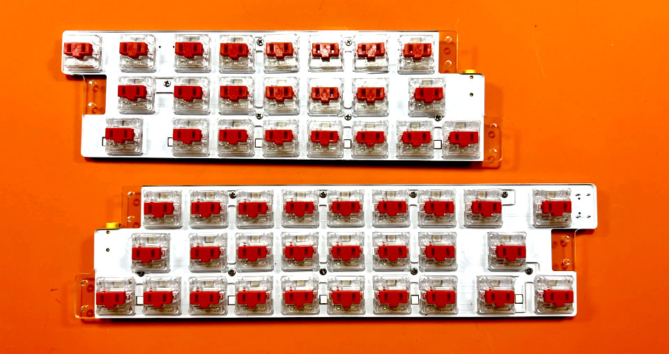
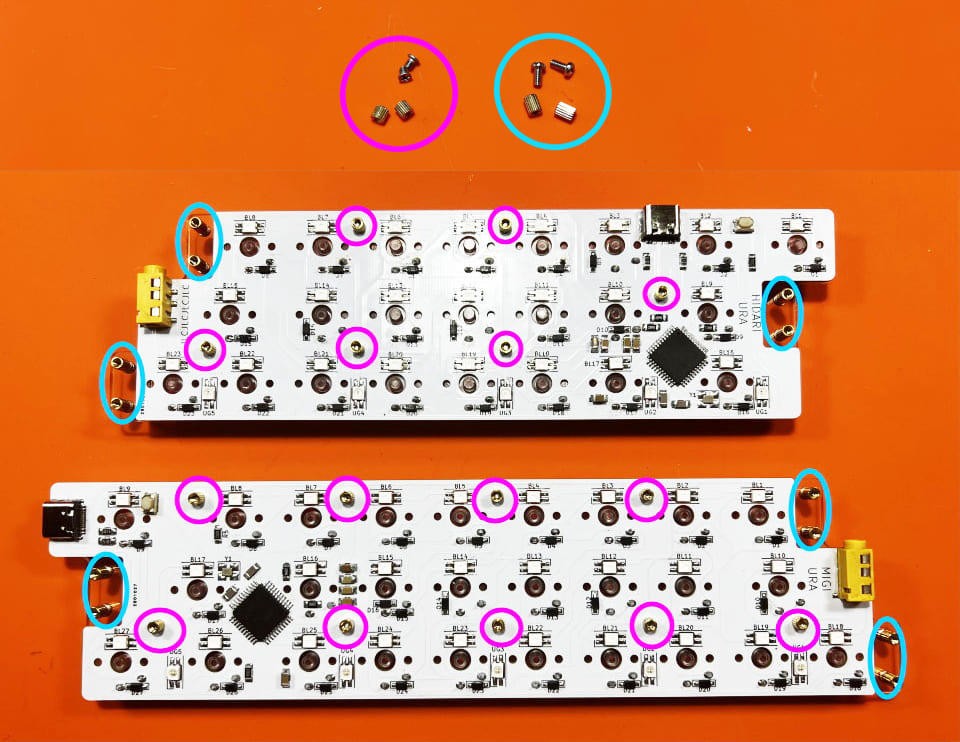
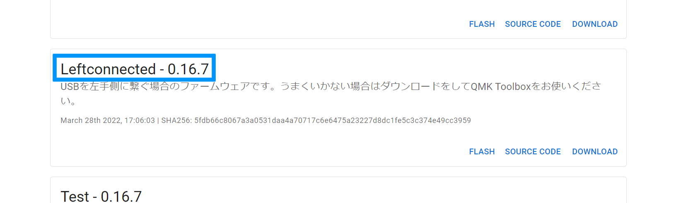
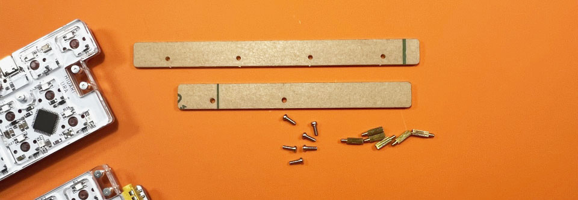

# Pop'n Top せまピッチ（[日本語](https://github.com/Taro-Hayashi/Pop-n-top-NarrowPitch/blob/main/README.md)）
- [キット内容](#キット内容)
- [キースイッチのはんだ付け](#キースイッチのはんだ付け)
- [プレートの取り付け](#プレートの取り付け)
- [キーマップのカスタマイズ](#キーマップのカスタマイズ)
- [そのほか](#そのほか)

## キット内容
  
  
||部品名|数| |
|-|-|-|-|
|1|メインボード|1||
|2|なべネジ小|15|2.5mm|
|3|なべネジ中|12|4mm|
|4|平ネジ|27|3.5mm|
|5|スペーサー小|15|3mm|
|6|スペーサー中|12|4mm|
|7|ゴム足|12||
|8|ミドルプレート小8|4||
|9|ミドルプレート小9|4||
|10|ミドルプレート小10|4||
|11|トッププレート|2||
|12|ミドルプレート大|2||
|13|ボトムプレート|2||

### キット以外に必要なもの
|部品名|数|||
|-|-|-|-|
|キースイッチ|50|Kailh choc V1|[遊舎工房](https://shop.yushakobo.jp/products/pg1350) / [TALP KEYBOARD](https://talpkeyboard.net/?category_id=620de8df0020fc01abddc60e) / [DailyCraftKeyboard](https://shop.dailycraft.jp/collections/choc-switches)|
|キーキャップ|50|choc V1用|[遊舎工房](https://shop.yushakobo.jp/collections/keycaps/For-Choc-v1) / [TALP KEYBOARD](https://talpkeyboard.net/?category_id=623833f723c2aa4779e17298) / [DailyCraftKeyboard](https://shop.dailycraft.jp/collections/choc-keycaps)|
|TRRSケーブル|1|||
|Type-Cケーブル|1|||

※キーキャップは18x17mm以下の大きさのものが使えます（WRKシリーズ、Kailhロープロ無刻印のクリアはサイズが大きく使えません）。

### 必要な工具
|工具名|
|-|
|はんだごて|
|こて先クリーナー（こて台）|
|鉛入りはんだ|
|精密ドライバー|

## キースイッチのはんだ付け
トッププレートをはさみこみ、キースイッチをはんだ付けします。  
  
はじめに4隅から取り付けると位置がズレにくいです。  
  
フラックスクリーナーを使う場合は綿棒などに滲みこませてフラックスの付いているところだけを拭いてください。
表面にフラックスクリーナーが浸透するとアクリルが割れてしまします。
  
TRRSケーブルで左右を繋ぎ、右手側にUSBケーブルを差してキーが入力されるか確認しましょう。
  

## プレートの取り付け
内側のネジ穴15か所（赤丸）にはナベネジ小とスペーサー小、外側のネジ穴12か所（青丸）にはナベネジ中とスペーサー中を取り付けます。
  
ミドルプレートをスペーサーに通します。
  
ミドルプレート小には種類が3つあるので確認しつつ使ってください。
  
バックプレートを平ネジ小でねじ止めしてゴム足を貼ります。
  
キーキャップを付けたら完成です。
  

## キーマップのカスタマイズ
ChromeかEdgeでRemapにアクセスしてください。  
- Remap https://remap-keys.app/

  
左を選んで進んでいくとアドレスバーからメッセージが出てキーボードを選択できます。  

ドラッグアンドドロップでキーマップの変更が終わったら右上のflashボタンを押すと反映されます。  
  

## そのほか

### USBケーブルを左手側に接続する
Remapにファームウェアがあります。
- [Pop'n Top NarrowPitch - Remap ](https://remap-keys.app/catalog/1fWEWCmfpZw3S95DBEu1/firmware)

両手側とも左手側接続用のファームウェアに更新し、TRRSケーブルで左右を繋いで左手側にUSBケーブルを接続します。
- [ファームウェアを更新する方法](firmware.md)

Remapにアクセスしてキーボードを選択し、キーマップをリセットするかレイアウトを復元してください。
- [Remap](https://remap-keys.app/)

レイアウトオプションからLeftを選択します。

### 片側だけ使う
USB接続側のファームウェアを個別にインストールして使ってください。

### 液タブに乗せる
同梱のフック、ネジ、スペーサーを使います。
  
傾斜が高い場合はゴム足を取り両面テープで貼り付けると安定します。
  

### ファームウェアのコード
https://github.com/Taro-Hayashi/qmk_firmware/tree/master/keyboards/tarohayashi/popntop_np

### VIA用JSON
- [popntop_np.json](https://github.com/Taro-Hayashi/Pop-n-top-NarrowPitch/releases/download/0.16.7/popntop_np.json)

### アクリルプレートのデータ
- [popntop_np.zip](https://github.com/Taro-Hayashi/Pop-n-top-NarrowPitch/releases/download/0.16.7/popntop_np.zip)

### 販売ページ
- BOOTH https://tarohayashi.booth.pm/items/3754822
