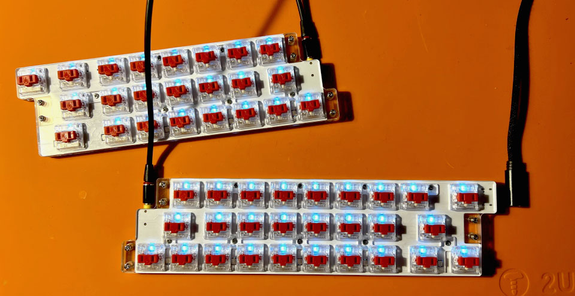
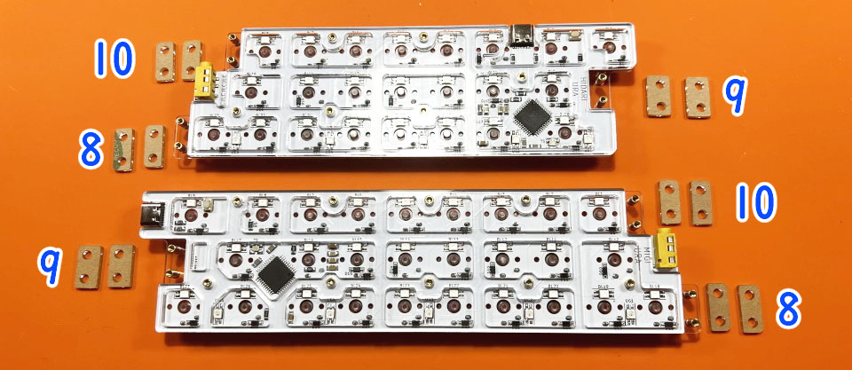

# Pop'n Top せまピッチ Build Manual（[日本語](https://github.com/Taro-Hayashi/Pop-n-top-NarrowPitch/blob/main/README.md)）
- [Contents](#Contents)
- [Soldering](#Soldering)
- [Assembling](#Assembling)
- [Customise](#Customise)
- [Misc](#Misc)

## Contents
  
  
||部品名|数| |
|-|-|-|-|
|1|メインボード|1||
|2|なべネジ小|15|2.5mm|
|3|なべネジ中|12|4mm|
|4|平ネジ|27|3.5mm|
|5|スペーサー小|15|3mm|
|6|スペーサー中|12|4mm|
|7|ゴム足|12||
|8|ミドルプレート小8|4||
|9|ミドルプレート小9|4||
|10|ミドルプレート小10|4||
|11|トッププレート|2||
|12|ミドルプレート大|2||
|13|ボトムプレート|2||

### キット以外に必要なもの
|部品名|数|||
|-|-|-|-|
|キースイッチ|50|Kailh choc V1|[遊舎工房](https://shop.yushakobo.jp/products/pg1350) / [TALP KEYBOARD](https://talpkeyboard.net/?category_id=620de8df0020fc01abddc60e) / [DailyCraftKeyboard](https://shop.dailycraft.jp/collections/choc-switches)|
|キーキャップ|50|choc V1用|[遊舎工房](https://shop.yushakobo.jp/collections/keycaps/For-Choc-v1) / [TALP KEYBOARD](https://talpkeyboard.net/?category_id=623833f723c2aa4779e17298) / [DailyCraftKeyboard](https://shop.dailycraft.jp/collections/choc-keycaps)|
|TRRSケーブル|1|||
|Type-Cケーブル|1|||

※キーキャップは18x17mm以下の大きさのものが使えます（WRKシリーズ、Kailhロープロ無刻印のクリア色はサイズが大きく使えません）。

### 必要な工具
|工具名|
|-|
|はんだごて|
|こて先クリーナー（こて台）|
|鉛入りはんだ|
|精密ドライバー|

## キースイッチのはんだ付け
トッププレートをはさみこみ、キースイッチをはんだ付けします。  
  
はじめに4隅から取り付けると位置がズレにくいです。  
  
フラックスクリーナーを使う場合は綿棒などに滲みこませてフラックスの付いているところだけを拭いてください。
表面にフラックスクリーナーが浸透するとアクリルが割れてしまします。
  
TRRSケーブルで左右を繋ぎ、右手側にUSBケーブルを差してキーが入力されるか確認しましょう。
  

## プレートの取り付け
内側のネジ穴15か所（赤丸）にはナベネジ小とスペーサー小、外側のネジ穴12か所（青丸）にはナベネジ中とスペーサー中を取り付けます。
  
ミドルプレートをスペーサーに通します。
  
ミドルプレート小には種類が3つあるので確認しつつ使ってください。
  
バックプレートを平ネジ小でねじ止めしてゴム足を貼ります。
  
キーキャップを付けたら完成です。
  

## キーマップのカスタマイズ
Access Remap.  
- Remap https://remap-keys.app/

Select the blue button on the left to proceed.  
  

After Drag-and-Drop the keys, press the flash button in the upper right corner.  
  

## Misc
### Pre-built Firmwares
https://remap-keys.app/catalog/1fWEWCmfpZw3S95DBEu1/firmware

### Firmware repository
https://github.com/Taro-Hayashi/qmk_firmware/tree/master/keyboards/tarohayashi/popntop_np

### JSON
- [popntop_np.json](https://github.com/Taro-Hayashi/Pop-n-top-NarrowPitch/releases/download/0.16.7/popntop_np.json)

### Plates data
- [popntop_np.zip](https://github.com/Taro-Hayashi/Pop-n-top-NarrowPitch/releases/download/0.16.7/popntop_np.zip)

### Store
- BOOTH https://tarohayashi.booth.pm/items/3754822
