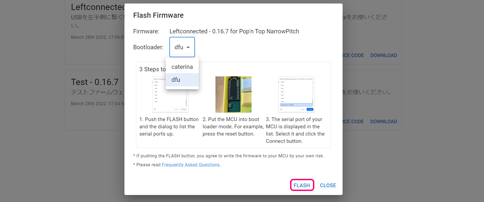
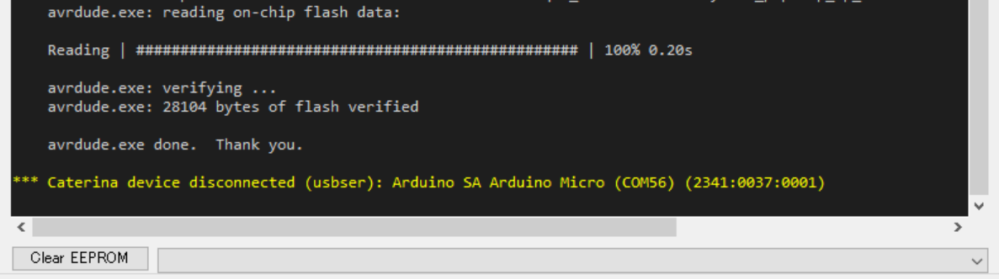

# ファームウェアを更新する方法

両手側共に同じファームウェアをインストールして使います。  
USB経由でしか更新ができないので、一度TRRSケーブルを外して片手ずつUSBケーブルを繋いで、計2回ファームウェアを更新します。

## Windows以外の場合
キーボードを接続した状態でRemapのファームウェアのページにアクセスしてください。  
- [Pop'n Top NarrowPitch - Remap ](https://remap-keys.app/catalog/1fWEWCmfpZw3S95DBEu1/firmware)

使用するファームウェアのFLASHを選んでください。  
  
Bootloaderをdftに変更します。  
  
FLASHを押すとダイアログが出てくるのでキーボード裏面のリセットボタンを押してください。 　
  
出てきたAtm32U4DFUを選択して接続します。  
  
更新が完了したらCLOSEで閉じてください。  
  
上手くいかない場合はWindwosの場合と同様にQMK Toolboxを使ってください。  
## Windowsの場合
キーボードを接続した状態でRemapのファームウェアのページにアクセスしてください。  
- [Pop'n Top NarrowPitch - Remap ](https://remap-keys.app/catalog/1fWEWCmfpZw3S95DBEu1/firmware)

使用するファームウェアのDownloadをクリックしてファームウェアをダウンロードしてください。  
   
QMK Toolboxのreleaseページから最新版をダウンロードしてインストールください（Betaはおすすめしません）。  
- [Releases・qmk/qmk_toolbox](https://github.com/qmk/qmk_toolbox/releases)

  
起動したらOpenを押してダウンロードしたファームウェアを指定し、キーボード裏面のリセットボタンを押します。  
   
新しく黄色の文字が出てきたらFlashを押します。  
  

Thank youの後に黄色い文字が出たら更新完了です。  
   

ブラウザの機能で戻ってください。  
